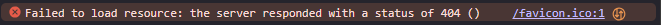

<!-- README.md is generated from README.Rmd. Please edit that file -->

```{r, include = FALSE}
knitr::opts_chunk$set(
  collapse = TRUE,
  comment = "#>",
  fig.path = "man/figures/README-",
  out.width = "100%"
)
```

# favawesome <a href="https://shinyworks.github.io/favawesome/"></a>

<!-- badges: start -->
[](https://lifecycle.r-lib.org/articles/stages.html#experimental)
[](https://CRAN.R-project.org/package=favawesome)
[](https://app.codecov.io/gh/shinyworks/favawesome)
[](https://github.com/shinyworks/favawesome/actions/workflows/R-CMD-check.yaml)
<!-- badges: end -->

Easily use {[fontawesome](https://rstudio.github.io/fontawesome/)} icons as Shiny favicons (the icons that appear on browser tabs).
[Font Awesome](https://fontawesome.com/) is a popular set of icons that can be used in web pages.
{favawesome} provides a simple way to use these icons as favicons in Shiny applications and other HTML pages.

## Installation

::: {.pkgdown-release}
You can install the latest release of favawesome from [CRAN](https://CRAN.R-project.org) with:

``` r
install.packages("favawesome")
```
:::

::: {.pkgdown-devel}
You can install the development version of favawesome from [GitHub](https://github.com/) with:

``` r
# install.packages("pak")
pak::pak("shinyworks/favawesome")
```
:::

## Motivation

If you've spent time in the Chrome Developer Tools Console (ctrl + shift + I) for Shiny apps, you may have seen this familiar error message:

```{r fig.alt="Failed to load resource: the server responded with a status of 404 () /favicon.ico:1", echo=FALSE}

```

False alarms make it easy to miss real error messages, so I wanted a way to silence that error message without adding a bunch of dependencies to my shiny app.
This package does not add any dependencies that are not already required by {[shiny](https://shiny.posit.co/r/)}.

## Usage

Add a call to `favawesome::fav()` to your Shiny UI code or other HTML.

``` r
html_page <- htmltools::tags$html(
  favawesome::fav("earth-africa", fill = "blue"),
  htmltools::tags$body(
    htmltools::tags$h1("Hello world!"),
    htmltools::tags$p("(on the browser tab)")
  )
)
htmltools::html_print(html_page, viewer = utils::browseURL)
```

## Code of Conduct

Please note that the {favawesome} project is released with a [Contributor Code of Conduct](https://shinyworks.github.io/favawesome/CODE_OF_CONDUCT.html). By contributing to this project, you agree to abide by its terms.
